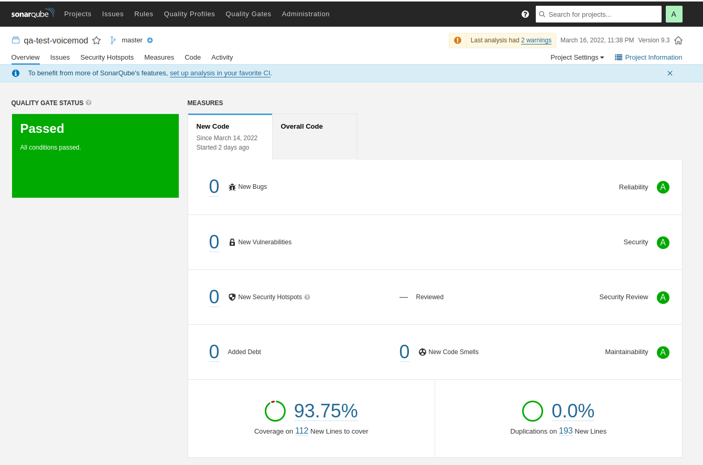

## Getting Started

### Prerequisites

## Install firefox webdriver on ubuntu 

```bash
./scripts/download-geckodriver.sh
```


## Instructions to prepare virtual environment:

Linux:

```bash
python3 -m venv venv
source venv/bin/activate
pip install -r requirements.txt
```

### Run project

Create config/config.ini file based on config.template.ini file with your parameters.

```bash
python tests/test_voicemod.py
```

## Lint the project with SonarQube

```bash
./scripts/run-sonar.sh
```

* Got to http://localhost:9000
* User/Password admin/admin and change your password
* http://localhost:9000/account/security/ and create a token
 
```bash
export sonarToken="your-token"
./scripts/run-sonar-scanner.sh
```


